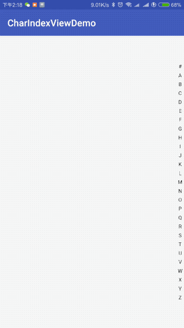

# JTCharIndexView [  ](https://bintray.com/william198824/maven/JTCharIndexView/_latestVersion)  [](./LICENSE)


## 一个超轻量级，通讯录音序列表。


### 功能：

1. 点击回调音序（字符串形式）
2. 超级轻量，超级简单，所以小白看看源码就能在上面改动扩展呢。
3. 基于java

### 安装：
```
dependencies {
    ......
    implementation 'com.william:JTCharIndexView:1.0.0'
}
```
### 用法：
#### java:
```java
非常简单，懒得说明了，详见demo
package com.william.charindexviewdemo

import android.os.Bundle
import android.support.v7.app.AppCompatActivity
import android.widget.Toast
import com.william.charindexview.CharIndexView
import kotlinx.android.synthetic.main.activity_main.*

class MainActivity : AppCompatActivity() ,CharIndexView.OnCharIndexChangedListener{

    override fun onCreate(savedInstanceState: Bundle?) {
        super.onCreate(savedInstanceState)
        setContentView(R.layout.activity_main)

        val labels = charArrayOf('#','A', 'B', 'C', 'D', 'E', 'F', 'G', 'H', 'I', 'J', 'K',
            'L', 'M', 'N', 'O', 'P', 'Q', 'R', 'S', 'T', 'U', 'V', 'W', 'X', 'Y', 'Z')

        this.civ.setCHARS(labels)
        this.civ.requestLayout()

        this.civ.setOnCharIndexChangedListener(this)
        this.civ.invalidate()
    }


    override fun onCharIndexSelected(currentIndex: String?) {
        Toast.makeText(this,"点击了"+currentIndex,Toast.LENGTH_SHORT).show()
    }
}
```
## License

    Copyright 2018 william Inc.

    Licensed under the Apache License, Version 2.0 (the "License");
    you may not use this file except in compliance with the License.
    You may obtain a copy of the License at

       http://www.apache.org/licenses/LICENSE-2.0

    Unless required by applicable law or agreed to in writing, software
    distributed under the License is distributed on an "AS IS" BASIS,
    WITHOUT WARRANTIES OR CONDITIONS OF ANY KIND, either express or implied.
    See the License for the specific language governing permissions and
    limitations under the License.
